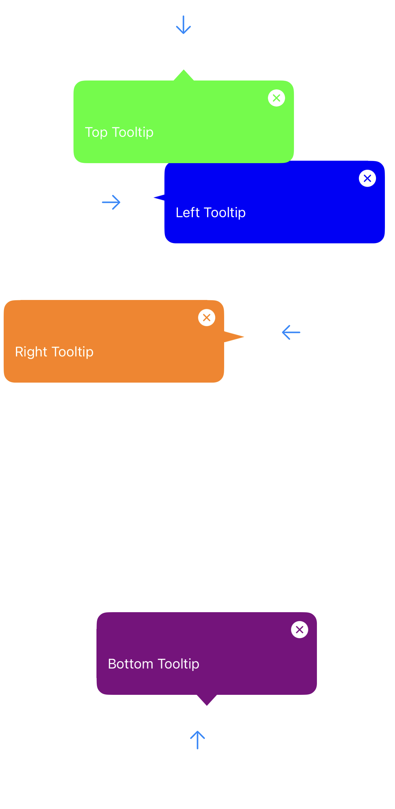
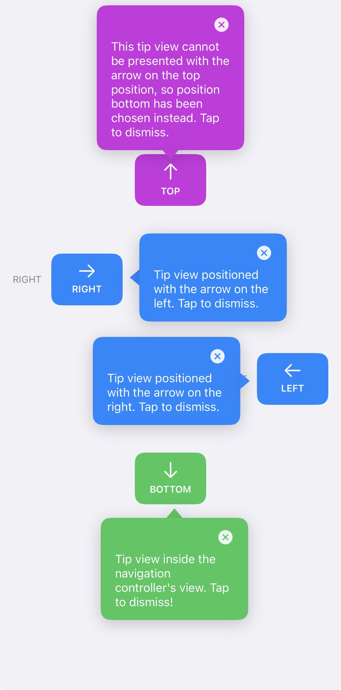

# TooltipKit

**TooltipKit** is a lightweight tooltip library for **SwiftUI and UIKit**, providing **manual X/Y positioning**, **arrow support (top / bottom / left / right)**, and **dismiss buttons**.

Designed for:

* Fine-grained control over tooltip position
* SwiftUI & UIKit parity
* Clean, predictable layout behavior
* Swift Package Manager compatibility

---

## Features

* ✅ SwiftUI & UIKit support
* ✅ Manual X / Y positioning
* ✅ Arrow support (top / bottom / left / right)
* ✅ Multiple independent tooltips
* ✅ Dismiss button support
* ✅ Absolute positioning mode
* ✅ iOS 15+

---
## Screenshots

### UIKit Tooltips                                              
  

### SwiftUI Tooltips



## Installation (Swift Package Manager)

1. Open your Xcode project
2. Go to **File → Add Packages…**
3. Choose **Add Local Package**
4. Select the repository folder:

```
IOS_TooltipKit
```

5. Add **TooltipKit**

---

## Import

```swift
import TooltipKit
```

---

# SwiftUI Usage

---

## 1️⃣ Minimal SwiftUI Usage

```swift
@StateObject private var tooltip = TooltipController()
```

```swift
Button("Show Tooltip") {
    tooltip.show("Hello from TooltipKit")
}
.tooltip(
    controller: tooltip,
    style: TooltipStyle()
)
```

---

## 2️⃣ SwiftUI – Manual X / Y Positioning

```swift
.tooltip(
    controller: tooltip,
    style: {
        var style = TooltipStyle()
        style.offsetX = 40
        style.offsetY = -70
        return style
    }()
)
```

---

## 3️⃣ Full SwiftUI Example (Final)

```swift
import SwiftUI
import TooltipKit

struct ContentView: View {

    @StateObject private var topTooltip = TooltipController()
    @StateObject private var rightTooltip = TooltipController()
    @StateObject private var leftTooltip = TooltipController()
    @StateObject private var bottomTooltip = TooltipController()

    var body: some View {
        ZStack {

            VStack(spacing: 50) {

                Button("TOP") {
                    topTooltip.show("Top Tooltip")
                }
                .tooltip(
                    controller: topTooltip,
                    style: {
                        var s = TooltipStyle()
                        s.arrowPosition = .bottom
                        s.offsetY = -70
                        return s
                    }()
                )

                Button("RIGHT") {
                    rightTooltip.show("Right Tooltip")
                }
                .tooltip(
                    controller: rightTooltip,
                    style: {
                        var s = TooltipStyle()
                        s.arrowPosition = .left
                        s.offsetX = 140
                        return s
                    }()
                )

                Button("LEFT") {
                    leftTooltip.show("Left Tooltip")
                }
                .tooltip(
                    controller: leftTooltip,
                    style: {
                        var s = TooltipStyle()
                        s.arrowPosition = .right
                        s.offsetX = -80
                        return s
                    }()
                )

                Button("BOTTOM") {
                    bottomTooltip.show("Bottom Tooltip")
                }
                .tooltip(
                    controller: bottomTooltip,
                    style: {
                        var s = TooltipStyle()
                        s.arrowPosition = .top
                        s.offsetY = 100
                        return s
                    }()
                )
            }
        }
        .onTapGesture {
            topTooltip.hide()
            rightTooltip.hide()
            leftTooltip.hide()
            bottomTooltip.hide()
        }
    }
}
```

---

# UIKit Usage

---

## 1️⃣ UIKit Setup

### Required properties

```swift
private var rightTooltip: TooltipManager!
private var leftTooltip: TooltipManager!
private var topTooltip: TooltipManager!
private var bottomTooltip: TooltipManager!
```

### Initialize in `viewDidLoad`

```swift
override func viewDidLoad() {
    super.viewDidLoad()

    rightTooltip = TooltipManager(containerView: view)
    leftTooltip = TooltipManager(containerView: view)
    topTooltip = TooltipManager(containerView: view)
    bottomTooltip = TooltipManager(containerView: view)
}
```

---

## 2️⃣ UIKit – Arrow + Manual X / Y (Final Pattern)

Each tooltip uses:

* `arrowPosition`
* `showsArrow = true`
* Independent X / Y offsets

---

## 3️⃣ Full UIKit Example (FINAL – Matches Your Code)

```swift
import UIKit
import TooltipKit

class ViewController: UIViewController {

    private var rightTooltip: TooltipManager!
    private var leftTooltip: TooltipManager!
    private var topTooltip: TooltipManager!
    private var bottomTooltip: TooltipManager!

    override func viewDidLoad() {
        super.viewDidLoad()

        rightTooltip = TooltipManager(containerView: view)
        leftTooltip = TooltipManager(containerView: view)
        topTooltip = TooltipManager(containerView: view)
        bottomTooltip = TooltipManager(containerView: view)
    }

    @IBAction func rightTap(_ sender: UIButton) {
        var style = UIKitTooltipStyle()
        style.backgroundColor = .blue
        style.showsArrow = true
        style.arrowPosition = .left
        style.usesAbsolutePositioning = true
        style.offsetX = -10
        style.offsetY = 0

        rightTooltip.show(
            text: "Right Tooltip",
            from: sender,
            style: style
        )
    }

    @IBAction func leftTap(_ sender: UIButton) {
        var style = UIKitTooltipStyle()
        style.backgroundColor = .orange
        style.showsArrow = true
        style.arrowPosition = .right
        style.usesAbsolutePositioning = true
        style.offsetX = -20
        style.offsetY = 10

        leftTooltip.show(
            text: "Left Tooltip",
            from: sender,
            style: style
        )
    }

    @IBAction func topTap(_ sender: UIButton) {
        var style = UIKitTooltipStyle()
        style.backgroundColor = .green
        style.showsArrow = true
        style.arrowPosition = .top
        style.usesAbsolutePositioning = true
        style.offsetX = 0
        style.offsetY = 30

        topTooltip.show(
            text: "Top Tooltip",
            from: sender,
            style: style
        )
    }

    @IBAction func bottomTap(_ sender: UIButton) {
        var style = UIKitTooltipStyle()
        style.backgroundColor = .purple
        style.showsArrow = true
        style.arrowPosition = .bottom
        style.usesAbsolutePositioning = true
        style.offsetX = 10
        style.offsetY = -20

        bottomTooltip.show(
            text: "Bottom Tooltip",
            from: sender,
            style: style
        )
    }
}
```

---

## Notes

* UIKit → **one `TooltipManager` per tooltip**
* SwiftUI → **one `TooltipController` per view**
* Arrow is **anchored to tooltip**, not the button
* `offsetX / offsetY` move both bubble and arrow together
 
